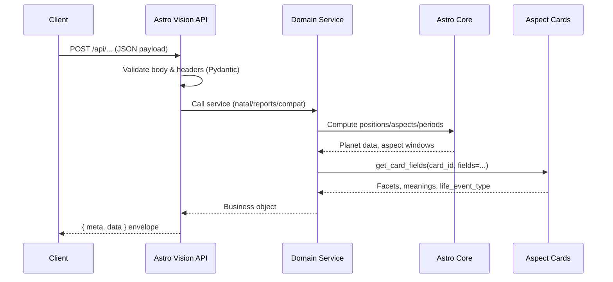
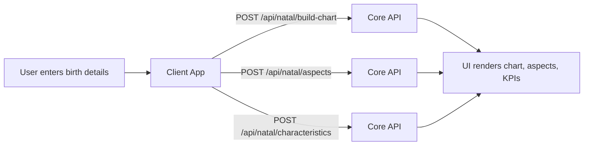
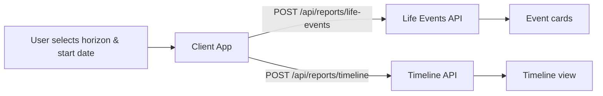
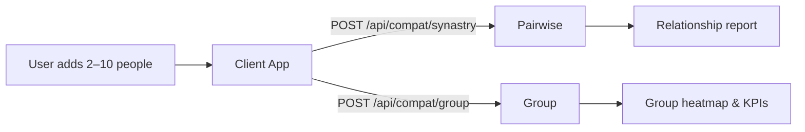

# Astro Vision (Phase‑1) — Business Document

> **Purpose**  
> This document positions Astro Vision — Core REST as a product, not just a codebase. It is written for product leaders, solution architects, and business stakeholders evaluating Phase‑1 readiness.

---

## 1. Executive Summary

Astro Vision — Core REST is a headless astrology engine delivered as an API‑first service. It combines Swiss Ephemeris–based calculations, custom aspect‑period logic, and a curated knowledge base of JSON "aspect cards" to provide:

- 🔭 Accurate natal charts by sign and house.
- 📅 Time‑bounded life events and timelines from transit‑to‑natal aspects.
- ❤️ Western synastry compatibility for pairs and groups.
- 🕉️ Vedic Ashtakoota (Gun Milan) scoring and explanation.

Phase‑1 focuses on getting the **foundations right**:

- Stable, typed REST API surface with consistent envelopes and error handling.
- Core natal, report, and compatibility flows wired to deterministic astro logic.
- A file‑backed aspect‑card knowledge base that drives narratives and life‑event labels.

Several narratives and scoring models are intentionally simple placeholders, but the contracts, headers, and orchestration endpoints are production‑grade and ready to integrate into real products.

---

## 2. High‑Level Architecture

### 2.1 System Landscape

```mermaid
flowchart LR
  subgraph Clients
    C1["Web / Mobile Apps"]
    C2["Partner Platforms"]
  end

  subgraph CoreAPI["Astro Vision — Core REST"]
    M["main.py\n(FastAPI app)"]
    R["api_router.py\n(/api routes)"]
    S["schemas.py\n(Pydantic models)"]
    SV["services/*\n(Natal, Reports, Compatibility)"]
    AC["astro_core/astro_core.py\n(Astro engine)"]
  end

  subgraph KB["Aspect Card Admin & KB"]
    ADM["aspect_card_mgmt.py\n(Admin + JSON API)"]
    FILES["kb/aspects/*.json\nkb/index.json"]
  end

  subgraph External
    SWE[("Swiss Ephemeris\n(pyswisseph)")]
  end

  C1 -->|HTTPS JSON| M
  C2 -->|HTTPS JSON| M

  M --> R
  R --> SV
  SV --> AC
  AC --> SWE

  SV -->|get_card_fields(...)| ADM
  ADM --> FILES
```

### 2.2 Request → Response Lifecycle



---

## 3. Value Proposition

### 3.1 Value Proposition Pyramid

```text
          ┌─────────────────────────────────────────────┐
          │            Business Outcomes                │
          │  • Higher engagement & retention            │
          │  • Premium report & matchmaking revenue     │
          └─────────────────────────────────────────────┘
          ┌─────────────────────────────────────────────┐
          │          User Experiences & Journeys        │
          │  • Natal insights, timelines, compatibility │
          │  • Group dynamics & Vedic matchmaking       │
          └─────────────────────────────────────────────┘
          ┌─────────────────────────────────────────────┐
          │       Platform Capabilities (This API)      │
          │  • Natal, reports, compat, Ashtakoota       │
          │  • KB‑driven narratives & facets            │
          └─────────────────────────────────────────────┘
          ┌─────────────────────────────────────────────┐
          │     Core Engine & Knowledge Base            │
          │  • Swiss Ephemeris astro core               │
          │  • Aspect‑card JSON knowledge base          │
          └─────────────────────────────────────────────┘
```

### 3.2 Product Differentiation

- 🧠 **Engine + KB together** — Combines deterministic astro math (`astro_core`) with a curated aspect‑card knowledge base, not just hard‑coded text.
- 🧩 **Multi‑system coverage** — Western natal, life‑event timelines, Western synastry (pair + group), and Vedic Ashtakoota are all served from one API.
- 🌐 **Localization‑ready content** — Aspect cards already support bilingual fields (English/Hindi), so localizing user experiences does not require engine changes.
- ⚙️ **API‑first, headless design** — No embedded UI assumptions (other than the separate admin app), enabling integration into any front‑end stack.
- 🔎 **Transparent contracts** — Strongly‑typed schemas, explicit envelopes, and consistent headers (`Meta`) simplify integration and observability.

> **Note**  
> Differentiation is based on patterns found in this repository (e.g., aspect‑card KB, multi‑system coverage). No unimplemented capabilities are claimed.

---

## 4. Business Capabilities (Phase‑1)

### 4.1 Capability Catalog

| # | Domain          | Capability                         | Primary Endpoints / Modules                          | Notes |
|---|-----------------|-------------------------------------|------------------------------------------------------|-------|
| 1 | 🌞 Natal        | Natal chart build                  | `POST /api/natal/build-chart`                        | Planet positions, signs, and houses (Whole Sign). |
| 2 | 🌞 Natal        | Natal aspect insights              | `POST /api/natal/aspects`                            | Aspect list enriched with aspect‑card meanings & facets. |
| 3 | 🌞 Natal        | Personality snapshot               | `POST /api/natal/characteristics`                    | Description + KPIs (placeholder text in Phase‑1). |
| 4 | 📅 Reports      | Life events catalogue              | `POST /api/reports/life-events`                      | Major/minor events from transit‑to‑natal aspect periods. |
| 5 | 📅 Reports      | Upcoming events (short horizon)    | `POST /api/reports/upcoming-events`                  | Near‑term subset of life events. |
| 6 | 📊 Reports      | Timeline view                      | `POST /api/reports/timeline`                         | Time‑ordered windows with descriptions, facets & actionables. |
| 7 | 📊 Reports      | Daily / weekly themes              | `POST /api/reports/daily-weekly`                     | Aggregated themes based on facets (per area). |
| 8 | ❤️ Compatibility| Pairwise synastry scoring          | `POST /api/compat/synastry`                          | Emotional, communication, chemistry, stability, element balance KPIs + total score. |
| 9 | 👥 Compatibility| Group compatibility (2–10 people)  | `POST /api/compat/group`                             | Group KPIs and pairwise rows for teams/families. |
|10 | 💌 Compatibility| Soulmate date suggestions          | `POST /api/compat/soulmate-finder`                   | Simple DOB suggestions around subject’s birth year (heuristic). |
|11 | 🕉️ Vedic       | Ashtakoota (Gun Milan) scoring     | `POST /api/compat/ashtakoota`                        | 8‑koota scores (0–36) + explanation string. |
|12 | 📚 Knowledge    | Aspect‑card admin & JSON API       | `aspect_card_utils.aspect_card_mgmt`                 | CRUD + field‑level JSON for aspect cards in `kb/aspects`. |
|13 | ⚙️ Platform     | Health / readiness                 | `GET /healthz`, `GET /readyz`                       | Basic liveness and readiness.

### 4.2 API‑First Design Philosophy

- **Contracts first** — Every capability is exposed via typed Pydantic models in `schemas.py` and documented through OpenAPI.
- **Headless by design** — The engine makes no assumptions about frontend; all business value is available via JSON.
- **Consistent envelopes** — All success responses share the `{ meta, data }` shape; errors use `ErrorResponse` with `ErrorEnvelope`.
- **Composable endpoints** — Clients can combine natal, reports, and compatibility calls to build higher‑level journeys without backend changes.

> **Assumption (verify)**  
> Long‑term positioning is as a reusable microservice within a broader platform; auth, billing, and advanced routing are expected to be handled by the surrounding infrastructure.

---

## 5. Knowledge‑Base Strategy

The **knowledge base (KB)** is the narrative heart of Astro Vision.

- **Storage** — Aspect cards are JSON files under `kb/aspects/`, indexed by `kb/index.json`.
- **Structure** — Each card represents one planet–aspect–planet pattern (e.g., `JUP_CON_MOO__v1.0.0`) and includes fields such as:
  - `core_meaning` (text or localized map).
  - `facets` (e.g., career, relationships, money, health).
  - `life_event_type` (labels used in `life-events`).
  - `actionables` (phase‑specific advice lists).
  - `locales` with bilingual content (e.g., English, Hindi).
- **Access pattern** — Services call `get_card_fields(card_id, fields=...)` from `aspect_card_utils.aspect_card_mgmt`.
- **Usage across journeys**:
  - Natal aspects → `characteristics` from cards.
  - Life events → `life_event_type` and description text.
  - Timeline & daily/weekly → `facets` and `actionables`.

> **Call‑out — Why this matters**  
> Because narratives live in JSON, not hard‑coded strings, content teams can iterate on tone, localization, and event tagging **without redeploying the engine**.

---

## 6. User Personas & Journeys

### 6.1 Personas

- **P1 · Consumer / End User**  
  Wants clear natal insights, upcoming themes, and compatibility scores in a friendly UI.

- **P2 · Astrologer / Content Curator**  
  Uses the aspect‑card admin UI to refine interpretations, life‑event tags, and actionables.

- **P3 · Product / Growth Manager**  
  Designs acquisition, engagement, and monetization journeys using Astro Vision outputs.

- **P4 · Backend / Platform Engineer**  
  Integrates these APIs into existing stacks, ensures reliability, and manages infra concerns.

### 6.2 Journey Flow Diagrams

#### 6.2.1 Natal Insight Journey



#### 6.2.2 Life‑Events & Timeline Journey



#### 6.2.3 Compatibility & Group Dynamics Journey



### 6.3 Use‑Case Catalog

| # | Journey               | Use Case                                   | Primary Actors            | API Calls (examples) |
|---|-----------------------|--------------------------------------------|---------------------------|----------------------|
| 1 | Natal Insight         | Birth chart & personality snapshot         | End User, Astrologer     | `POST /api/natal/build-chart`, `.../aspects`, `.../characteristics` |
| 2 | Life‑Events           | Upcoming life windows for planning         | End User                 | `POST /api/reports/life-events`, `.../upcoming-events` |
| 3 | Timeline              | Long‑range trend visualization             | End User, Product Teams  | `POST /api/reports/timeline` |
| 4 | Daily / Weekly Themes | Lightweight “astro‑weather” feed           | End User, Product Teams  | `POST /api/reports/daily-weekly` |
| 5 | Pairwise Compatibility| Relationship compatibility overview         | End User (Couples)       | `POST /api/compat/synastry` |
| 6 | Group Dynamics        | Team/family cohesion overview              | Product Teams, Partners  | `POST /api/compat/group` |
| 7 | Vedic Matchmaking     | Marriage suitability (Gun Milan)           | End User, Astrologer     | `POST /api/compat/ashtakoota` |
| 8 | Content Ops           | Curation of aspect narratives & tags       | Astrologer / Curator     | `aspect_card_mgmt` admin & JSON API |

---

## 7. Business Applications

### 7.1 B2C Applications

- Mobile or web astrology apps offering natal readings, timelines, and relationship reports.
- Subscription products where advanced reports (e.g., timelines, group compatibility) are premium tiers.

### 7.2 B2B Applications

- White‑label APIs consumed by partner apps that want high‑quality astrology features without building an engine.
- Integration into wellness, dating, or coaching platforms as a background insight engine.

### 7.3 Partnerships

- Partnerships with content brands where aspect‑card narratives are co‑branded and delivered through this engine.

> **Assumption (verify)**  
> These applications reflect natural usage patterns inferred from the API surface; commercial packaging is decided outside this repo.

---

## 8. Commercial Potential & Monetization Options

While commercial models are not encoded in the codebase, the API design enables several options:

- **Per‑call or per‑MAU pricing** based on report and compatibility calls.
- **Tiered plans** (e.g., Natal only → Natal + Reports → Full stack including Vedic and group compatibility). *Assumption (verify).* 
- **Premium feature bundles** (e.g., timelines and group reports as add‑ons). *Assumption (verify).* 
- **Enterprise licensing** for partners embedding the engine into their platforms. *Assumption (verify).* 

---

## 9. Inputs & Outputs

### 9.1 Input Overview

| Category        | Field(s)                                     | Type / Format                   | Used By                           | Notes |
|-----------------|----------------------------------------------|----------------------------------|-----------------------------------|-------|
| Identity        | `name`                                      | String                           | All journeys                      | Display name only. |
| Birth Data      | `dateOfBirth`                               | `YYYY-MM-DD`                     | Natal, Reports, Compatibility     | Required. |
|                 | `timeOfBirth`                               | `HH:MM` or `HH:MM:SS` (24h)      | Natal, Reports, Compatibility     | Required. |
|                 | `placeOfBirth`                              | String (city, country)           | Primarily UX                      | Not used directly in core logic. |
| Coordinates     | `latitude`, `longitude`                     | Decimal                          | Natal, Reports, Compatibility     | North/east positive. |
| Timezone        | `timeZone`                                  | IANA TZ (e.g., `Asia/Kolkata`)   | All engine flows                  | Internally converted via `zoneinfo`. |
| Reporting       | `timePeriod`                                | Enum: `1Y`, `6M`, `1M`, `1W`, `1D` | `timeline`, `daily-weekly`      | Controls horizon and sampling. |
|                 | `reportStartDate` / `start_date`            | `YYYY-MM-DD`                     | `life-events`, `upcoming-events`, `timeline` | Anchor date. |
|                 | `horizon_days`                              | Integer (days)                   | `life-events`, `upcoming-events`  | Time span ahead. |
|                 | `mode`                                      | Enum: `DAILY`, `WEEKLY`          | `daily-weekly`                    | Output aggregation mode. |
| Compatibility   | `type`                                      | String enum (e.g., `General`, `Marriage`, `Friendship Group`) | `synastry`, `group`, `ashtakoota` | Controls KPI weights & interpretation where applicable. |
| Headers         | `X-Request-ID`, `X-Session-ID`, `X-Transaction-ID`, `X-User-ID`, `X-App-ID` | String | All endpoints | Optional; used for tracing in `Meta`. |

### 9.2 Output Overview

| Category          | Key Objects                               | Highlights |
|-------------------|-------------------------------------------|-----------|
| Natal Chart       | `NatalChartData.planets[]`                | Planet name, sign, degree, house number/name/sign. |
| Natal Aspects     | `NatalAspectsOut.items[]`                 | Aspect label, angle, strength, and `characteristics` from aspect cards. |
| Characteristics   | `NatalCharacteristicsData`                | Description string + KPI list (placeholder Phase‑1 content). |
| Life Events       | `LifeEventsOut.events[]`                  | Aspect label, MAJOR/MINOR type, dates, and description. |
| Timeline          | `TimelineOut.data.items[]`                | Aspect window, description, keyPoints, facets_points, plus `aiSummary` string. |
| Daily / Weekly    | `DailyWeeklyOut.data`                     | `shortSummary` + `areas` dict aggregating facets. |
| Pairwise Compat   | `CompatibilityOut.data`                   | KPI scores (0–1), combined totalScore, and summary text. |
| Group Compat      | `GroupCompatibilityOut.data`              | Pairwise rows, group KPIs, totalGroupScore. |
| Soulmate Finder   | `SoulmateOut.data.datesOfBirth[]`         | Suggested DOBs near subject’s birth year. |
| Vedic Ashtakoota  | `AshtakootaOut.data`                      | Per‑koota scores, total (0–36), and explanation string. |
| Meta              | `Meta`                                    | Timestamp, IDs, version, and request context. |
| Errors            | `ErrorResponse`                           | Machine‑readable error code + details. |

---

## 10. Benefits

### 10.1 Business Benefits

- **Faster time‑to‑market** — Product teams can launch natal, report, and compatibility features without building an astro engine from scratch.
- **Consistent experiences** — Aspect‑card–driven narratives ensure similar users see consistent interpretations across journeys.
- **Upsell opportunities** — Timelines, group reports, and Vedic matching provide natural premium features. *Assumption (verify).* 

### 10.2 Technical Benefits

- **Professional‑grade astro core** using Swiss Ephemeris and configurable ayanamsa.
- **API‑first, language‑agnostic integration** — any client capable of HTTP+JSON can integrate.
- **Configurable behavior** via environment variables and headers without changing code.

### 10.3 Operational Benefits

- **Stateless service** — easy to scale horizontally.
- **Health endpoints** — `/healthz` and `/readyz` ready for orchestrators and load balancers.
- **Structured logging and IDs** — request IDs and session metadata simplify monitoring and debugging.

---

## 11. Constraints & Architectural Guardrails (Phase‑1)

> **Constraints Call‑out**  
> These limits are based strictly on the current codebase and should be considered when scoping go‑live.

### 11.1 Functional Constraints

- **No built‑in authentication / authorization** — The service trusts the caller; security must be provided by gateways or upstream components. *(Assumption (verify): an API gateway or auth proxy will front the service.)*
- **No user persistence** — There is no concept of stored user accounts, sessions, or saved reports in this repo.
- **Placeholder narratives** — Natal characteristics and some summaries are simple stub text, not full production copy.

### 11.2 Integration & Data Constraints

- **No messaging connectors** — No direct email/SMS/WhatsApp integrations are present. *(Assumption (verify).)*
- **No document export** — No built‑in PDF or document generation pipeline. *(Assumption (verify).)*
- **File‑based KB only** — Aspect cards live on the filesystem; there is no DB or vector store in this repo.

### 11.3 Observability & Ops Constraints

- **Minimal metrics / tracing** — Basic logging is present; advanced tracing and metrics are not implemented.
- **Simple readiness checks** — `/readyz` is a simple flag, not a deep dependency probe.

---

## 12. Phase‑1 Readiness Checklist

Use this as a quick checklist before exposing Astro Vision to external clients:

- [ ] **Infra** — Service deployed behind TLS, with appropriate `CORS_ALLOW_ORIGINS` and `TRUSTED_HOSTS` configured.
- [ ] **Auth** — Upstream authentication/authorization in place (e.g., gateway, proxy). *Assumption (verify).* 
- [ ] **KB Content** — Aspect cards in `kb/aspects` reviewed, approved, and aligned with brand tone.
- [ ] **Locales** — At least English/Hindi fields verified where used in timelines and daily/weekly.
- [ ] **Rate Limits** — External rate limiting / quota strategy decided and implemented outside this service.
- [ ] **Monitoring** — Logs collected centrally; alerting configured on error rates and health endpoints.
- [ ] **Test Coverage** — Core API smoke tests and ayanamsa tests passing in CI.
- [ ] **Commercial Packaging** — Pricing and SKU mapping to API capabilities agreed. *Assumption (verify).* 

---

## 13. Future Roadmap (Phase‑2+)

> **Roadmap items are directional and not yet implemented. Treat each as Assumption (verify).**

- **Deeper natal narratives** — Generate personality narratives using aspect cards and KPIs instead of the current stub text.
- **Real dignities & scoring** — Replace dummy `dignities_table` output with proper dignities and essential strength calculations.
- **Richer reports** — Convert `TimelineData.aiSummary` and aspect‑card content into multi‑section, long‑form reports.
- **Language expansion** — Extend aspect‑card `locales` to additional languages.
- **Advanced observability** — Add metrics, structured tracing, and deeper readiness checks.
- **Optional DB / retrieval layer** — Introduce DB or vector search for more advanced content retrieval using `retrieval.embedding_sections` hints in aspect cards.

---

## 14. Glossary (Alphabetical)

- **Ayanamsha** — Angular offset between tropical and sidereal zodiacs; configured via `astro_core.astro_core`.
- **Aspect** — Specific angular relationship between two planets (e.g., conjunction, sextile, square, trine, opposition).
- **Aspect Card** — JSON knowledge object in `kb/aspects` describing meanings, facets, life‑event types, and actionables for a planet–aspect–planet combination.
- **Ashtakoota (Gun Milan)** — Vedic compatibility framework assigning up to 36 points across 8 kootas to evaluate marriage suitability.
- **Compatibility (Synastry)** — Comparison of two natal charts to assess relationship potential using planetary aspects and trait balances.
- **Facets** — Themed interpretations in aspect cards (e.g., career, relationships, money, health) used to tag events and daily/weekly themes.
- **Gun** — A single point in the Ashtakoota system; total scores range from 0 to 36.
- **House** — One of 12 chart divisions representing life areas (e.g., self, partnership); this engine uses Whole Sign houses.
- **KB (Knowledge Base)** — The collection of JSON, CSV, and index files under `kb/` that power interpretations and life‑event tagging.
- **Meta Envelope** — Standard metadata block (`Meta`) attached to each response, including timestamp, IDs, and version.
- **Sidereal / Tropical** — Two zodiac reference systems: sidereal is fixed‑star–based (with ayanamsa), tropical is equinox‑based.
- **Synastry Group Analysis** — Extension of synastry across multiple people to summarize pairwise dynamics and group harmony.

